

# 4-20 mA Transmitter(Sensor) using PIC16F17146 microcontroller

## Introduction
This example demonstrates how the 4-20 mA current sensor is simulated using PIC16F17146 microcontroller and click boards.

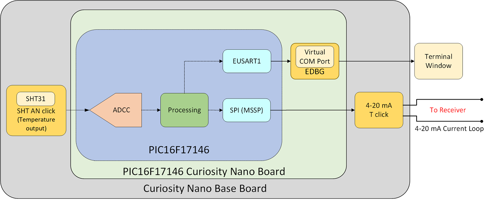

 In this application, the current flowing through the loop is varied over the range of 4 to 20mA according to the sensor output. For setting up the current, a 4-20 mA T click which includes XTR116 current loop transmitter and MCP4921(12-bit DAC) is used. The XTR116 is controlled by the output of MCP4921. The PIC16F17146 microcontroller communicates with the DAC inside 4-20 mA T click over the SPI interface.

 A SHT AN click features SHT31 sensor which is used for sensor measurement. The temperature output from SHT is read using ADCC. The ADCC result is processed so that the current is set between 4 mA and 20 mA according to the measured temperature and sent to the DAC of 4-20 mA T click over SPI.

The 4-20 mA current sensor can be interfaced to a 4-20 mA current loop receiver using internal Operational Amplifier and 12-bit Analog to Digital converter of PIC16F17146. Please refer to the [4-20 mA Current Loop Receiver](https://github.com/microchip-pic-avr-examples/pic16f17146-4-20-mA-receiver-mplab-mcc) example for implementation details.

## Related Documentation
-	[PIC16F17146 Product Page](https://www.microchip.com/PIC16F17146)
-	[PIC16F17146 Data Sheet](https://www.microchip.com/DS40002343)

## Software Used
-	MPLAB® X IDE [6.00 or newer](https://www.microchip.com/mplab/mplab-x-ide)
-	Microchip XC8 Compiler [2.40 or newer](https://www.microchip.com/mplab/compilers)
-	MPLAB® Code Configurator (MCC) [5.1.17 or newer](https://www.microchip.com/mplab/mplab-code-configurator)
-	Microchip PIC16F1xxxx Series Device Support (DFP) [1.15.191 or newer](https://packs.download.microchip.com/)

## Hardware Used
-	[PIC16F17146 Curiosity Nano Board](https://www.microchip.com/en-us/development-tool/EV72J15A)
-	[Curiosity Nano Base Board](https://www.microchip.com/development-tool/AC164162)
-	[	4-20 mA T Click](https://www.mikroe.com/4-20ma-t-click)
-	[SHT AN Click](https://www.mikroe.com/sht-an-click)

## Application Overview
This section explains the implementation of 4-20 mA current loop using PIC16F17146 and click boards.

### Sensor Measurement
SHT AN click carrying SHT31-ARP-B sensor is used in this application. SHT31-ARP-B gives analog outputs for temperature and humidity measurement. The onboard mux can be used to select the required output. For this application, temperature readings are used. Refer below figure for internal blocks of click.

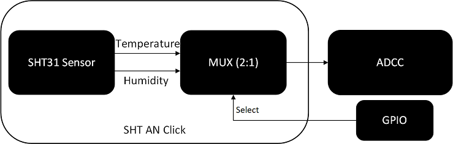

### Current Setting
The transmitter adjusts the current flowing through the loop according to the temperature measured. For adjusting the current, a 4-20 mA T click having XTR116 current loop transmitter is used. XTR116 is controlled by the output of MCP4921, a 12-bit DAC. It requires voltage in the range of 7.5-36 V to operate. The DAC output is controlled over the SPI interface by the processed ADCC result from the PIC16F17146 microcontroller. The 4-20 mA T click also provides galvanic isolation from the current loop via the ADuM1411 digital isolator. The figure below shows the internal blocks of 4-20 mA T click.

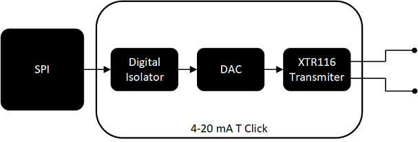

DAC values corresponding to 4mA and 20mA should be determined. This can be accomplished by changing the DAC output and measuring the corresponding current flowing through the loop using a multimeter. The procedure to find out these DAC values are described in the [Transmitter Calibration](https://github.com/microchip-pic-avr-examples/pic16f17146-4-20-mA-transmitter-sensor-mplab-mcc#transmitter-calibration) section.

### Sensor Parameter to Current Conversion
The conversion from temperature reading to DAC value is carried out using the following formula.

`DAC_COUNT = (TEMP_READING-LOWEST_TEMP) * (DAC_COUNT_20mA- DAC_COUNT_4mA)/(HIGHEST_TEMP- LOWEST_TEMP) + DAC_COUNT_4mA`

For this example,
LOWEST_TEMP is set as 0 °C.
HIGHEST_TEMP is set as 100 °C.

*Note: If any other sensor is used at the transmitter side, remember to change macros in the “main.c” file according to the sensor and its range. This should match with the receiver firmware for correct operation.*

[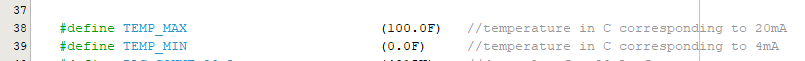](https://github.com/microchip-pic-avr-examples/pic16f17146-4-20-mA-transmitter-sensor-mplab-mcc/blob/master/pic16f17146-4-20-mA-transmitter-sensor-mplab-mcc.X/main.c#L38)

DAC_COUN20mA and DAC_COUNT4mA are the DAC values required to set 20 mA and 4 mA of current, respectively. The [Transmitter Calibration](https://github.com/microchip-pic-avr-examples/pic16f17146-4-20-mA-transmitter-sensor-mplab-mcc#transmitter-calibration) section explains the procedure to find out these DAC values.

### Transmitter Calibration

To perform the calibration of the 4-20 mA transmitter click, determine the 4-20 mA T click’s DAC register values corresponding to 4 mA and 20 mA current through the loop.

First power the transmitter by connecting the Curiosity Nano board to the PC USB port. The loop side of the transmitter is powered from the loop. Make sure the loop has sufficient voltage required by XTR116. The loop can be powered either by a dc source or by a boost click of the current loop receiver.

To calibrate the transmitter, try updating DAC values over the range of 0 to 4095. Use a multimeter to measure the current and record the DAC values for 4mA and 20mA of current. The respective DAC values are then used in the transmitter firmware.

*Note: To update the DAC values in runtime, a terminal window can be used. This demo does not include the calibration process.*

For the setup of this example, a DAC value of 810 for 4mA and a DAC value of 4015 for 20mA have been recorded. These values can vary depending on the cable type and length used.

[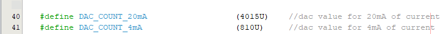](https://github.com/microchip-pic-avr-examples/pic16f17146-4-20-mA-transmitter-sensor-mplab-mcc/blob/master/pic16f17146-4-20-mA-transmitter-sensor-mplab-mcc.X/main.c#L40)

## Hardware Setup
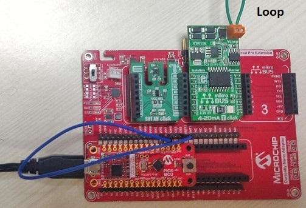

## Hardware Connection
PIC16F17146 curiosity nano board is used as the development platform. Curiosity nano base board is used for connecting click boards to the nano board. SHT AN and 4-20 mA T click are placed in mikroBUS™ click slot 1 and 2, respectively.  

## Pin Connection Table
| Microcontroller Pin |	Signal Description
| --- | -------------------
| RC6	| SPI SCK, 4-20 mA T SCK
| RC5	| SPI MOSI, 4-20 mA T SDI
| RC3	| 4-20 mA T CS1
| RA2	| SHT AN AN
| RA5	| SHT AN RST
| RC7 |	SHT AN SEL
| RB7 |	EUSART1 TX
| RB5	| EUSART1 RX

1Note: Connection from PIC16F17146 curiosity nano to click slot is not available for this pin. CS2 and AN2 of Curiosity Nano Base Board are shorted using a jumper cable to make this connection.

## Demo Operation
The temperature is measured and the current flowing through the loop is adjusted accordingly by setting the corresponding DAC value. The measured temperature is displayed on the terminal window.

The microcontroller sends data to the PC with a baud rate of 9600 using UART with the help of the virtual serial port feature of the onboard debugger. To see the messages in the terminal window, connect the curiosity nano board to any terminal emulator.

The temperature value and DAC value are sent to the terminal window.

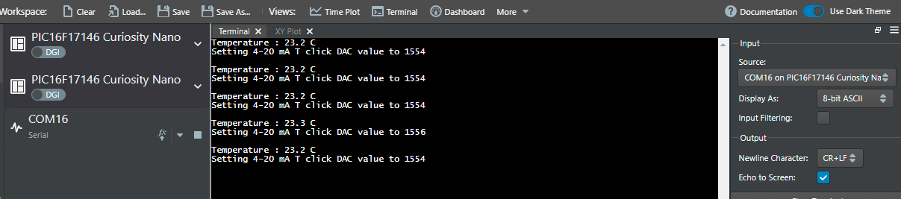

## Peripheral Configuration using MCC
This section explains how to configure the peripherals using MPLAB X IDE with the MCC plugin for the recreation of the project.

Refer [Software Used](https://github.com/microchip-pic-avr-examples/pic16f17146-4-20-mA-transmitter-sensor-mplab-mcc#software-used) section to install the required tools to recreate the project.

Additional Links: [MCC Melody Technical Reference](https://onlinedocs.microchip.com/v2/keyword-lookup?keyword=MCC.MELODY.INTRODUCTION&redirect=true)

##### Peripheral Configuration Summary
|    Module                  |    Configuration                                                                                                                                                                                                                                                                                                                                                       |    Usage                                                                   |
|--------------------------------|----------------------------------------------------------------------------------------------------------------------------------------------------------------------------------------------------------------------------------------------------------------------------------------------------------------------------------------------------------------------------|--------------------------------------------------------------------------------|
|    Clock Control           |    Clock Source   – HFINTOSC    HF Internal Clock – 4 MHz    Clock Divider – 4                                                                   |    System clock   |                                 
|    ADCC                    |    Enable ADCC    Input   Configuration –  Single Ended Mode    Operating   Mode – Busrt Average Mode    Result   Alignment – Right justified    Positive   Reference – VDD Acquisition Count – 20         Clock Source – FOSC  Clock Divider – FOSC/4       Repeat – 8   Accumulator Right Shift – 3 | Monitors SHT31 sensor’s output                                          |
|    MSSP1                    |    Serial Protocol – SPI  Mode – Host SPI mode – SPI Mode 0 Input Data Sampled at – End  Clock Source Selection – FOSC/4         |  Communicates with 4-20 TX click                                                      |
|    EUSART1                 |    *UART1 Driver* Requested Baudrate –   9600  Enable Redirect   STDIO to EUSART      UART PLIB Selector – EUSART1   *EUSART1 PLIB*      Enable   Receive   Enable Transmit    Enable Serial   Port                                                                                                                                                                                              |    Sends data to   PC terminal                                              |

##### Peripheral Configuration using MCC

###### Clock Control
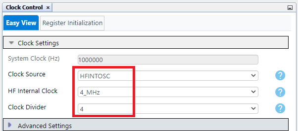

###### ADCC
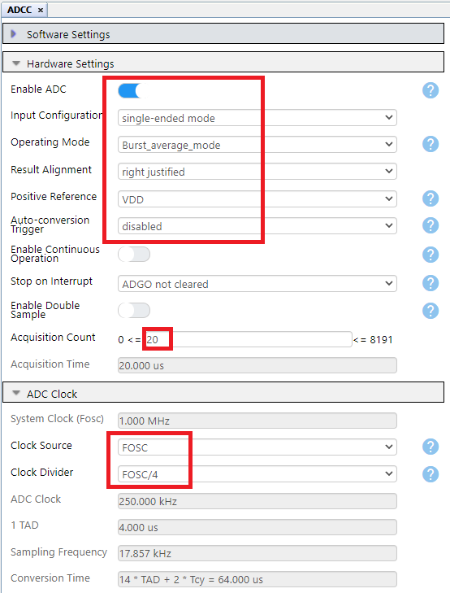

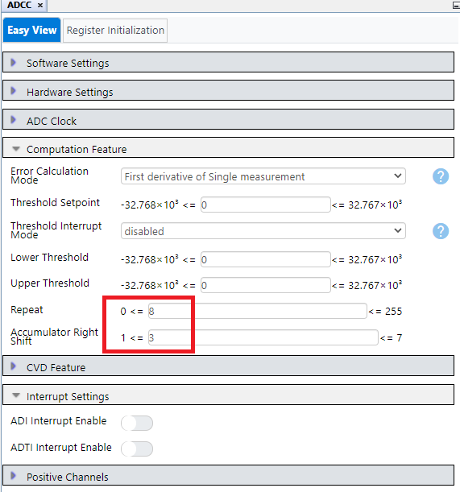
###### MSSP1
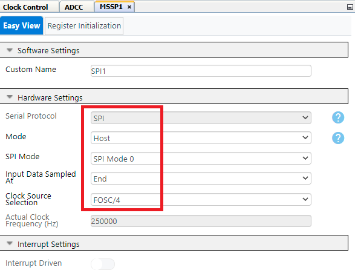

###### UART1 Driver
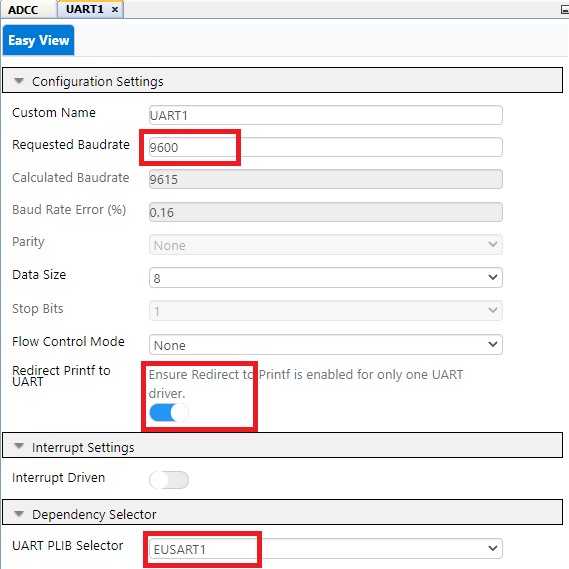

###### EUSART1 PLIB
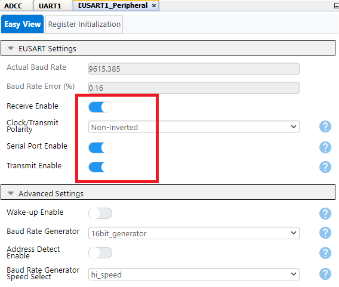

*Note: The onboard debugger present on the curiosity nano board has a virtual serial port (CDC) that is connected to a Universal Asynchronous Receiver/Transmitter (UART) on the PIC16F17146 and provides an easy way to communicate with the target application through terminal software. Refer curiosity nano user guide for more details.*

###### Pins
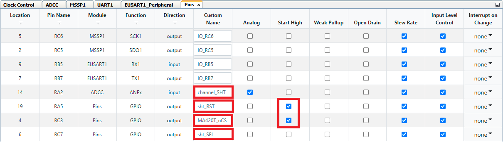

###### Pin Grid View
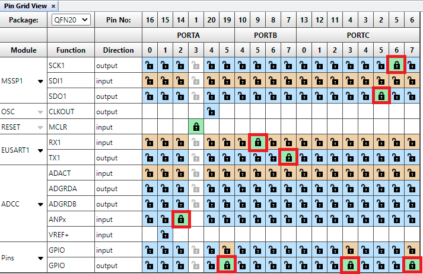

## Summary
This code example implemented a 4-20 mA sensor using PIC16F17146 microcontroller and 4-20 mA T click.
